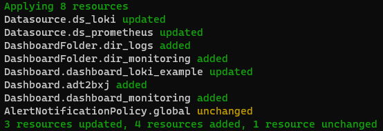

This section provides a convenient way to build a customized image of Grafana as described in this [post](https://medium.com/p/157166dce55d).

---

# Installation of the Grafana's dashboards for the demo

1) install Grizzly with the script ```chmod +x ./install_grizzly.sh && ./install_grizzly.sh```,

2) Logged as an admin in Grafana, create a service account token as described [here](https://medium.com/p/157166dce55d) (Section "Service account"),

3) Copy the generated token in the following code snippet, update the Grafana's URL

```bash
    grr config set grafana.url "http://<IP_OF_AN_ORCHESTRATOR>:8080/"
    grr config set grafana.token "<MY_NEW_TOKEN>"
    grr config set targets Datasource,DashboardFolder,LibraryElement,Dashboard,AlertRuleGroup,AlertNotificationPolicy,AlertContactPoint,AlertNotificationTemplate
    grr config set output-format json
```

4) Copy/paste those lines in the prompt,

5) Move to the folder `part9` and then type the command `grr push ./part9/grizzly`, the result should look like this



---

# Creation of the customized Grafana image

1) Import the Grafana image

Move to the folder ```commons``` and then type the following commands

```bash
sudo ./import-image-into-local-repo.sh --local-registry-address <LOCAL_REGISTRY_ADDRESS> --local-registry-port <LOCAL_REGISTRY_PORT> --image-name grafana/grafana --image-version <Grafana's version>
```

2) Create and export your Grafana content as explained in the post,

3) Create your customized Grafana images by using the script `create-custom-grafana-image.sh`

```bash
chmod +x ./create-custom-grafana-image.sh
sudo create-custom-grafana-image.sh --local-registry-address <LOCAL_REGISTRY_IP_ADDRESS> \
                                    [--local-registry-port <LOCAL_REGISTRY_PORT>] \
                                    --admin-passwd <The admin password to set for your customized Grafana> \
                                    --grafana-url <The URL of the Grafana instance running in the swarm> \
                                    --sa-token <The token of the service account of the Grafana instance running in the swarm> \
                                    [--image-version <The version number of your customized image (--version-number value by default)>] \
                                    --version-number <Grafana's version number>
```

4) Then update the stack ```sudo PRIVATE_REPO=<IP_ADDRESS_OF_THE_REPO>:<LOCAL_REGISTRY_PORT> docker stack deploy --compose-file docker-compose.yml iot-stack```

To check the installation, please check the [list of the useful commands](../../../docker-swarm-useful-commands.md).

---

# Troubleshootings

If you face any issues, please refer to this [page](../../../docker-swarm-troubleshooting.md).
